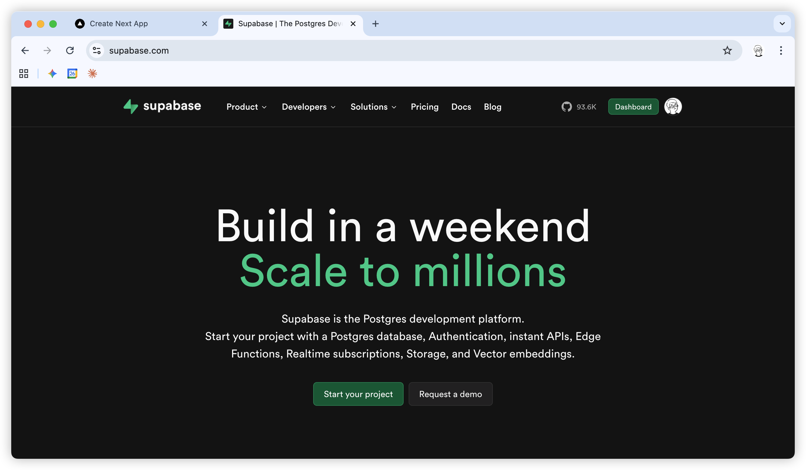
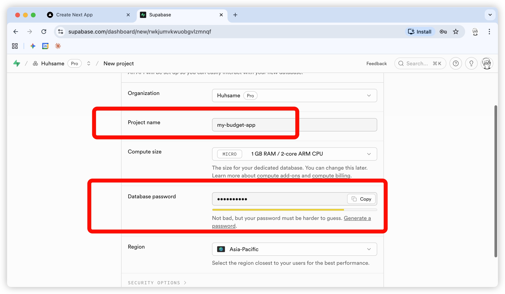

# 챕터 6. 데이터베이스와 Supabase

> 이 챕터에서는 데이터베이스가 무엇인지, 왜 필요한지 알아봅니다.
> 그리고 Supabase에 가입하고 프로젝트를 생성합니다.

---

## 6-1. 왜 데이터베이스가 필요한가

### 지금 만든 가계부의 문제점

챕터 5에서 만든 가계부를 실행해보세요.

1. 수입/지출 몇 개를 입력합니다
2. 브라우저를 **새로고침**합니다
3. 입력한 데이터가 **전부 사라집니다**


### 왜 사라질까?

지금 만든 가계부는 데이터를 **브라우저 메모리**에만 저장합니다.
브라우저를 새로고침하거나 닫으면 메모리가 초기화되어 데이터가 사라집니다.

```
[브라우저 메모리]
   ↓ 새로고침
[초기화됨 - 데이터 없음]
```

### 해결 방법: 데이터베이스

데이터를 영구적으로 저장하려면 **데이터베이스(DB)**가 필요합니다.

```
[사용자 입력] → [데이터베이스에 저장]
      ↓
[새로고침해도 데이터베이스에서 불러옴]
```

데이터베이스에 저장하면:
- 새로고침해도 데이터가 유지됩니다
- 브라우저를 닫았다 다시 열어도 데이터가 남아있습니다
- 다른 기기에서 접속해도 같은 데이터를 볼 수 있습니다

---

## 6-2. 데이터베이스 = 엑셀

데이터베이스는 어렵게 생각할 필요 없습니다.
**엑셀과 거의 똑같습니다.**

### 엑셀과 데이터베이스 비교

| 엑셀 | 데이터베이스 |
|------|-------------|
| 엑셀 파일 (.xlsx) | 데이터베이스 |
| 시트 (Sheet) | 테이블 (Table) |
| 행 (가로줄) | Row (로우) |
| 열 (세로줄) | Column (컬럼) |
| 셀 (칸 하나) | Field (필드) |

### 가계부를 엑셀로 만든다면?

엑셀로 가계부를 만든다고 생각해보세요.


| id | 날짜 | 유형 | 카테고리 | 금액 | 메모 |
|----|------|------|----------|------|------|
| 1 | 2025-01-27 | 지출 | 식비 | 15000 | 점심 |
| 2 | 2025-01-27 | 지출 | 교통 | 3000 | 버스 |
| 3 | 2025-01-28 | 수입 | 급여 | 3000000 | 월급 |

이것이 바로 **테이블**입니다.

### 데이터베이스 구조

```
데이터베이스 (= 엑셀 파일)
└── 테이블: transactions (= 시트)
    ├── 컬럼: id (= 열)
    ├── 컬럼: date
    ├── 컬럼: type
    ├── 컬럼: category
    ├── 컬럼: amount
    └── 컬럼: memo
```

---

## 6-3. DB 용어 쉽게 이해하기

개발할 때 자주 등장하는 데이터베이스 용어들을 쉽게 정리합니다.

### 기본 용어

| 용어 | 쉬운 설명 | 엑셀 비유 |
|------|----------|----------|
| **Database (DB)** | 데이터를 저장하는 곳 | 엑셀 파일 전체 |
| **Table** | 데이터를 담는 표 | 시트 하나 |
| **Row** | 데이터 한 줄 | 행 하나 (가로줄) |
| **Column** | 데이터의 항목/종류 | 열 하나 (세로줄) |
| **Field** | 데이터 한 칸 | 셀 하나 |

### 자주 나오는 용어

| 용어 | 쉬운 설명 |
|------|----------|
| **Primary Key (PK)** | 각 row를 구분하는 고유 번호. 주민번호 같은 것. 보통 `id`라는 이름을 씀 |
| **Insert** | 새 데이터 추가하기 (새 행 추가) |
| **Select** | 데이터 조회하기 (데이터 읽기) |
| **Update** | 데이터 수정하기 |
| **Delete** | 데이터 삭제하기 |

### SQL이란?

데이터베이스에게 명령을 내리는 **특별한 프로그래밍 언어**입니다.

```sql
SELECT * FROM transactions WHERE type = '지출'
```

위 코드는 "거래 내역 중에서 지출만 보여줘"라는 의미입니다.

> **몰라도 됩니다!** 클로드 코드가 대신 작성해주니까요.
> 그냥 "이런 게 있구나" 정도만 알아두세요.

---

## 6-4. Supabase란?

### 내 컴퓨터에 DB를 설치한다면?

데이터베이스를 직접 설치하고 운영하려면:

1. 데이터베이스 소프트웨어 설치 (MySQL, PostgreSQL 등)
2. 서버 설정
3. 보안 설정
4. 백업 설정
5. 24시간 서버 켜두기
6. ...

**비개발자에게는 너무 어렵고 복잡합니다.**

### Supabase가 대신해줍니다

**Supabase**는 이 모든 것을 대신 해주는 서비스입니다.

| 직접 설치 | Supabase 사용 |
|----------|--------------|
| DB 설치 필요 | 필요 없음 |
| 서버 관리 필요 | 필요 없음 |
| 복잡한 설정 | 클릭 몇 번으로 끝 |
| 비용 발생 | 무료로 시작 가능 |

### Supabase의 장점

- **무료**: 개인 프로젝트 2개까지 무료로 충분
- **쉬움**: 웹 화면에서 클릭만으로 테이블 생성
- **빠름**: 가입 후 5분이면 사용 가능
- **안전**: 보안, 백업을 알아서 처리

---

## 6-5. Supabase 가입하기


브라우저에서 아래 주소로 접속하여 회원가입을 합니다.

```
https://supabase.com
```




---

## 6-6. 프로젝트 생성하기

Supabase에서는 프로젝트 단위로 데이터베이스를 관리합니다.
가계부용 프로젝트를 만들어봅시다.

### Step 1: New Project 

새로운 프로젝트를 생성합시다. 이름과 패스워드를 지정합니다.


> **Region은 가까운 지역** 을 선택해야 속도가 빠릅니다.


### Step 5: 프로젝트 생성 대기

프로젝트 생성에 1~2분 정도 걸립니다.
완료되면 프로젝트 대시보드로 이동합니다.


---

## 6-7. MCP란?

다음 챕터에서 클로드 코드와 Supabase를 연결할 건데요,
여기서 **MCP**라는 것을 사용합니다.

### MCP = 클로드 코드의 확장 기능

**MCP (Model Context Protocol)**는 클로드 코드가 외부 서비스와 직접 연결할 수 있게 해주는 기능입니다.

```
[클로드 코드] ←--MCP--→ [Supabase]
```

MCP를 설정하면:
- 클로드가 **직접** Supabase에 접속할 수 있습니다
- 테이블 생성, 데이터 조회/수정을 클로드가 알아서 합니다
- 복잡한 연결 코드를 작성할 필요가 없습니다

### 비유로 이해하기

**MCP 없이 연결하면:**
```
나: "클로드야, DB 연결해줘"
클로드: "API 키랑 URL 알려줘"
나: (Supabase에서 찾아서 복사)
클로드: (연결 코드 작성)
나: (코드 실행하다 에러 발생)
클로드: (에러 수정...)
```

**MCP로 연결하면:**
```
나: "클로드야, DB 연결해줘"
클로드: (MCP로 직접 Supabase에 접속)
클로드: "연결했어, 뭐 할까?"
```

**훨씬 간단합니다!**

### MCP 설정 방법 (미리보기)

Supabase 대시보드에서 연결 명령어를 복사해서 실행하면 끝!

```powershell
claude mcp add --scope user --transport http supabase "https://mcp.supabase.com/mcp?project_ref=프로젝트ID"
```

자세한 설정 방법은 다음 챕터에서 배웁니다.

### MCP 지원 서비스들

Supabase 외에도 다양한 서비스가 MCP를 지원합니다.

| 서비스 | 용도 |
|--------|------|
| **Supabase** | 데이터베이스 |
| **GitHub** | 코드 저장소 |
| **Slack** | 메신저 연동 |
| **Google Drive** | 파일 접근 |
| 기타 | 계속 추가 중... |

---

## 정리

| 개념 | 설명 |
|------|------|
| **데이터베이스** | 데이터를 영구적으로 저장하는 곳 |
| **테이블** | 엑셀의 시트와 같음 |
| **Row** | 데이터 한 줄 (행) |
| **Column** | 데이터 항목 (열) |
| **Supabase** | DB를 쉽게 사용할 수 있게 해주는 서비스 |
| **MCP** | 클로드 코드가 외부 서비스와 직접 연결하는 기능 |

**다음 챕터에서는** MCP로 클로드 코드와 Supabase를 연결합니다.

---

<div style="text-align: center; margin-top: 40px;">

[← 이전: 챕터 5. 가계부 실습 - 각자 개발](chapter-05.md) | [다음: 챕터 7. 가계부에 Supabase 연결하기 →](chapter-07.md)

</div>
